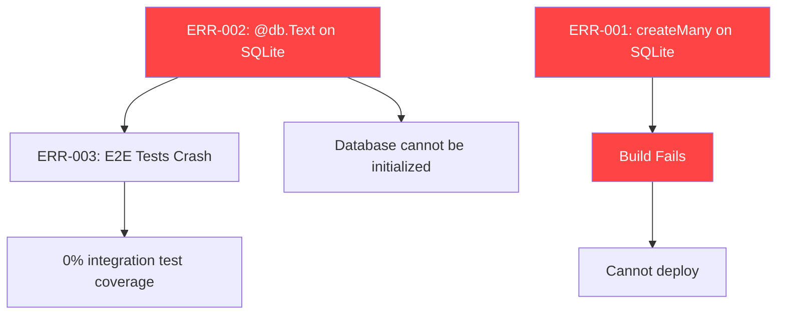

# 🔍 ERROR ANALYSIS — CampusShare Platform

**Generated**: 2026-02-12T18:59:00+05:30  
**Agent**: Local CI/CD Testing Agent

---

## Critical Errors (Build Blockers)

### 🔴 ERR-001: `createMany` Not Supported on SQLite

| Property | Value |
|----------|-------|
| **Severity** | 🔴 CRITICAL |
| **File** | `src/app/api/items/route.ts:209` |
| **Type** | Type Error / ORM Incompatibility |
| **Blocks** | Production Build |

**Error Message**:
```
Property 'createMany' does not exist on type 'AvailabilityDelegate<DefaultArgs>'
```

**Root Cause**:  
Prisma's SQLite connector does not support `createMany()`. This method is only available for PostgreSQL, MySQL, and SQL Server.

**Impact**:  
The item update API route (PUT handler) cannot compile. Any `npm run build` will fail.

**Fix Options**:

1. **Replace with loop** (quick fix — stays on SQLite):
```typescript
// Instead of:
await tx.availability.createMany({
  data: availability.map((day: string) => ({
    itemId: id,
    dayOfWeek: day
  }))
});

// Use:
for (const day of availability) {
  await tx.availability.create({
    data: { itemId: id, dayOfWeek: day }
  });
}
```

2. **Switch to PostgreSQL** (recommended for production):
   - Update `schema.prisma` datasource to `postgresql`
   - Update `DATABASE_URL` in `.env`
   - `createMany()` will work natively

---

### 🔴 ERR-002: `@db.Text` Not Supported on SQLite

| Property | Value |
|----------|-------|
| **Severity** | 🔴 CRITICAL |
| **File** | `prisma/schema.prisma:28, 29, 33` |
| **Type** | Schema Validation Error |
| **Blocks** | Database Setup (`prisma db push`) |

**Error Message**:
```
Native type Text is not supported for sqlite connector.
```

**Affected Fields** (in `Account` model):
- `refresh_token` (line 28)
- `access_token` (line 29)
- `id_token` (line 33)

**Root Cause**:  
The `@db.Text` attribute is a PostgreSQL/MySQL native type. SQLite stores all strings as `TEXT` by default and doesn't need this annotation.

**Fix**:
```diff
- refresh_token      String? @db.Text
+ refresh_token      String?
- access_token       String? @db.Text
+ access_token       String?
- id_token           String? @db.Text
+ id_token           String?
```

---

## High Severity Issues

### 🟠 ERR-003: E2E Tests Crash on Database Setup

| Property | Value |
|----------|-------|
| **Severity** | 🟠 HIGH |
| **Files** | `tests/admin-protection.spec.ts`, `tests/booking-flow.spec.ts` |
| **Type** | Test Infrastructure Failure |
| **Blocks** | All integration tests |

**Root Cause**:  
Tests use `test-utils.ts` which imports `../src/lib/db` (Prisma client) to create test users and items. Because `prisma db push` fails (ERR-002), no tables exist. All `beforeAll` hooks crash with `0ms` duration.

**Fix**:  
Resolve ERR-002 first, then run `npx prisma db push` to create tables.

---

### 🟠 ERR-004: Deprecated `middleware` Convention

| Property | Value |
|----------|-------|
| **Severity** | 🟠 HIGH |
| **File** | `src/middleware.ts` (inferred) |
| **Type** | Deprecation Warning |
| **Blocks** | Future Next.js upgrades |

**Warning**:
```
The "middleware" file convention is deprecated. Please use "proxy" instead.
```

**Root Cause**:  
Next.js 16 has deprecated the `middleware.ts` file convention in favor of the new `proxy` API.

**Fix**:  
Migrate middleware to the new proxy pattern per [Next.js migration guide](https://nextjs.org/docs/messages/middleware-to-proxy).

---

## Medium Severity Issues (Warnings)

### 🟡 WARN-001: Unused Variables (6 instances)

| File | Variable | Line |
|------|----------|------|
| API route | `e` | 78 |
| API route | `req` | 26 |
| Bookings page | `session` | 43 |
| Bookings page | `error` | 89 |
| Component | `LogOut` | 19 |
| Component | `Settings` | 19 |
| Component | `error` | 36 |

**Fix**: Remove unused imports/variables or prefix with `_`.

---

### 🟡 WARN-002: Missing useEffect Dependencies

| File | Line | Missing Deps |
|------|------|-------------|
| Bookings page | 57 | `fetchBookings`, `router` |

**Fix**: Add missing dependencies to the dependency array, or wrap function in `useCallback`.

---

### 🟡 WARN-003: `` Instead of `<Image />`

| File | Line |
|------|------|
| Component | 155 |
| Component | 49 |

**Fix**: Replace `` with Next.js `<Image />` component for automatic optimization.

---

## Error Dependency Chain



---

## Recommended Fix Priority

| Priority | Error | Effort | Impact |
|----------|-------|--------|--------|
| 1 | ERR-002 — Remove `@db.Text` | 2 min | Unblocks DB + tests |
| 2 | ERR-001 — Replace `createMany` | 5 min | Unblocks build |
| 3 | ERR-003 — Re-run tests | 1 min | Validates fixes |
| 4 | ERR-004 — Migrate middleware | 30 min | Future-proofs app |
| 5 | WARN-001/002/003 — Cleanup | 10 min | Code quality |
