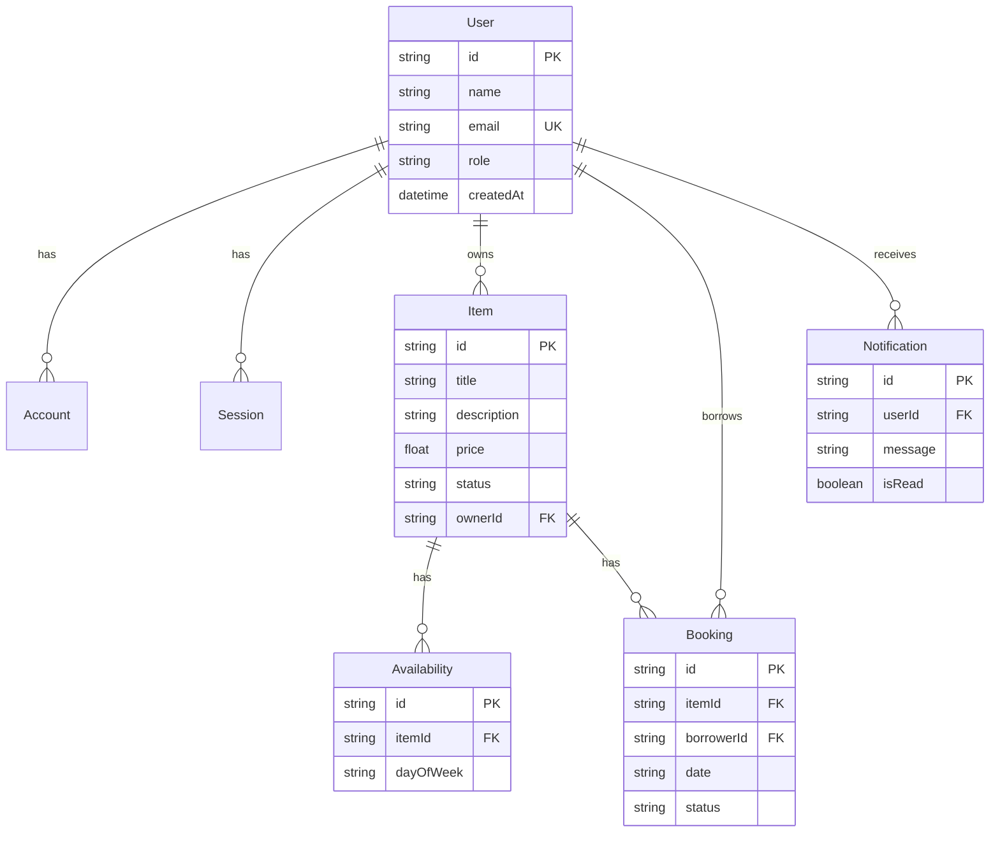
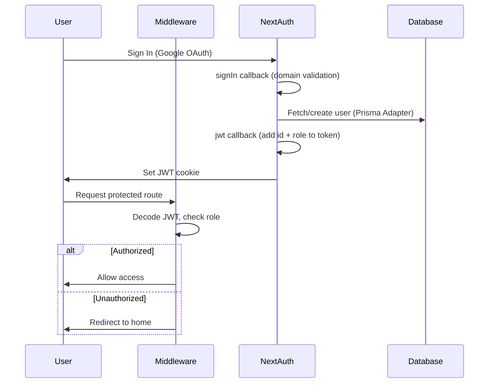
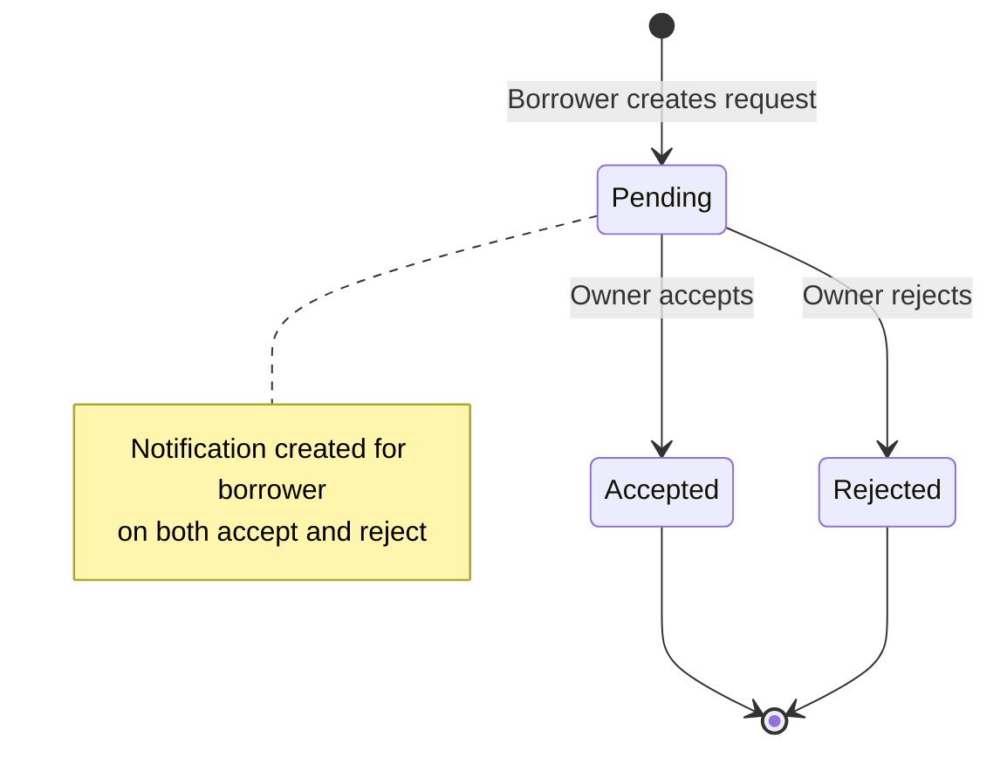

# CampusShare Platform — Architecture Documentation

> **Version:** 1.0  
> **Last Updated:** 2026-02-12  
> **Stack:** Next.js 14 (App Router) · TypeScript · Prisma · NextAuth.js · Tailwind CSS

---

## 1. Project Overview

CampusShare is a peer-to-peer rental platform for campus communities. Students can list items for rent, browse available items, and request bookings — all within a domain-restricted, authenticated environment.

### Core Capabilities

| Feature          | Description                                                    |
|------------------|----------------------------------------------------------------|
| Authentication   | Google OAuth via NextAuth.js, domain-restricted sign-in        |
| Item Management  | CRUD operations for rental items with day-of-week availability |
| Booking Workflow | Request → Accept/Reject lifecycle with notifications           |
| Notifications    | System-generated alerts for booking status changes             |
| Admin Dashboard  | Platform statistics and user management (role-gated)           |

---

## 2. Architecture Overview

```
┌────────────────────────────────────────────────────────┐
│                     Next.js App Router                  │
│                                                         │
│  ┌──────────┐  ┌───────────┐  ┌──────────────────────┐ │
│  │  Pages   │  │Components │  │   API Routes         │ │
│  │ (Server  │  │ (Client & │  │ /api/items           │ │
│  │  & Client│  │  Server)  │  │ /api/bookings        │ │
│  │  Comps)  │  │           │  │ /api/notifications   │ │
│  └────┬─────┘  └─────┬─────┘  │ /api/auth/[...next]  │ │
│       │              │        └──────────┬───────────┘ │
│       └──────────────┴──────────────────┐│             │
│                                          ▼             │
│              ┌──────────────────────────────┐          │
│              │         Prisma ORM           │          │
│              │     (Singleton in db.ts)     │          │
│              └──────────────┬───────────────┘          │
│                             ▼                          │
│              ┌──────────────────────────────┐          │
│              │      SQLite Database         │          │
│              │     (prisma/dev.db)          │          │
│              └──────────────────────────────┘          │
│                                                         │
│  ┌──────────────────────────────────────────────────┐  │
│  │              Middleware (middleware.ts)           │  │
│  │  Route protection + RBAC (JWT-based)             │  │
│  └──────────────────────────────────────────────────┘  │
└────────────────────────────────────────────────────────┘
```

---

## 3. Directory Structure

```
src/
├── app/                          # Next.js App Router pages
│   ├── layout.tsx                # Root layout (fonts, providers)
│   ├── page.tsx                  # Home page (item listing)
│   ├── loading.tsx               # Global loading skeleton
│   ├── globals.css               # Tailwind CSS config
│   ├── admin/dashboard/page.tsx  # Admin stats panel (protected)
│   ├── api/                      # API route handlers
│   │   ├── auth/[...nextauth]/   # NextAuth catch-all route
│   │   ├── bookings/             # Booking CRUD (POST, GET)
│   │   │   └── [id]/             # Booking by ID (PATCH)
│   │   ├── items/                # Item CRUD (POST, GET, DELETE)
│   │   │   └── [id]/             # Item by ID (GET, PATCH, DELETE)
│   │   └── notifications/        # Notification retrieval (GET)
│   ├── dashboard/
│   │   ├── bookings/page.tsx     # Booking management UI
│   │   └── profile/page.tsx      # User profile & listings
│   ├── items/[id]/page.tsx       # Item detail view
│   ├── post-item/page.tsx        # "List New Item" form
│   └── search/page.tsx           # Search interface
│
├── components/
│   ├── auth/
│   │   ├── LoginButton.tsx       # Sign In/Out toggle
│   │   └── Providers.tsx         # NextAuth SessionProvider wrapper
│   ├── items/
│   │   ├── AddItemForm.tsx       # Create/Edit item form (Zod + react-hook-form)
│   │   ├── BookingRequestButton.tsx # Date picker + booking submit
│   │   ├── EditItemActions.tsx   # Owner: Edit/Delete buttons
│   │   └── ItemCard.tsx          # Item summary card
│   ├── layout/
│   │   ├── Header.tsx            # Top navigation bar
│   │   └── BottomNav.tsx         # Mobile bottom navigation
│   └── ui/                       # shadcn/ui primitives (badge, button, card, popover)
│
├── lib/
│   ├── auth.ts                   # NextAuth configuration
│   ├── db.ts                     # Prisma Client singleton
│   └── utils.ts                  # cn() utility
│
├── types/
│   └── next-auth.d.ts            # Extended Session & JWT types
│
└── middleware.ts                  # Route protection & RBAC
```

---

## 4. Data Models (Prisma Schema)



---

## 5. Authentication Flow



### Key Design Decisions

- **Strategy: `jwt`** — Chosen over `database` so that `middleware.ts` can access the user role from the JWT token without hitting the database on every request.
- **Domain restriction** — The `ALLOWED_DOMAIN` env var limits sign-in to specific email domains (e.g., university).
- **Singleton Prisma** — `db.ts` uses the global cache pattern to prevent connection exhaustion during Next.js hot reloads.

---

## 6. API Reference

| Method   | Endpoint                  | Auth Required | Description                        |
|----------|---------------------------|:-------------:|------------------------------------|
| `GET`    | `/api/items`              |       No      | List active items (supports `?query=`) |
| `POST`   | `/api/items`              |      Yes      | Create a new item                  |
| `DELETE` | `/api/items?id=`          |      Yes      | Delete an item (owner only)        |
| `GET`    | `/api/items/[id]`         |       No      | Get item by ID                     |
| `PATCH`  | `/api/items/[id]`         |      Yes      | Update item (owner only)           |
| `DELETE` | `/api/items/[id]`         |      Yes      | Delete item (owner only)           |
| `GET`    | `/api/bookings?type=`     |      Yes      | List bookings (incoming/outgoing)  |
| `POST`   | `/api/bookings`           |      Yes      | Create booking request             |
| `PATCH`  | `/api/bookings/[id]`      |      Yes      | Accept/reject booking (owner only) |
| `GET`    | `/api/notifications`      |      Yes      | Get user's notifications (max 20)  |

---

## 7. Booking Lifecycle



### Validation Rules (POST /api/bookings)

1. User must be authenticated.
2. Item must exist and be `active`.
3. Date must be valid (`YYYY-MM-DD` format).
4. Requested day-of-week must match item's availability.
5. No duplicate booking for same item + same date by same user.
6. User cannot book their own item.

---

## 8. Security Model

| Layer       | Mechanism                 | Scope                                |
|-------------|---------------------------|--------------------------------------|
| Middleware  | JWT token role check      | `/dashboard/*`, `/admin/*`, `/post-item` |
| API Routes  | `getServerSession` check  | All mutation endpoints               |
| Ownership   | `ownerId` comparison      | Edit/Delete items, Accept/Reject bookings |
| Sign-in     | Domain validation         | Configurable via `ALLOWED_DOMAIN`    |

---

## 9. Environment Variables

| Variable              | Purpose                                |
|-----------------------|----------------------------------------|
| `GOOGLE_CLIENT_ID`    | Google OAuth client ID                 |
| `GOOGLE_CLIENT_SECRET`| Google OAuth client secret             |
| `NEXTAUTH_SECRET`     | JWT signing secret                     |
| `NEXTAUTH_URL`        | Application URL (for callbacks)        |
| `ALLOWED_DOMAIN`      | Restrict sign-in to this email domain  |
| `DATABASE_URL`        | Prisma database connection (if not SQLite default) |

---

## 10. Known Limitations & Technical Debt

| Issue | Details |
|-------|---------|
| Missing `SignOutButton` component | `src/app/dashboard/profile/page.tsx` imports from `@/components/auth/SignOutButton` which does not exist. Creates a build error. |
| Missing `@radix-ui/react-popover` | Popover UI component may fail if this dependency isn't installed. |
| No image upload | Items have no image field — text-only listings. |
| SQLite in production | Schema uses SQLite (`file:./dev.db`). Should be migrated to PostgreSQL for production. |
| No pagination | Item listing and notifications lack pagination — performance degrades at scale. |
| Alert-based UX | Error/success messages use `window.alert()` instead of toast notifications. |
| No email notifications | Notifications are in-app only; no email/push channel. |

---

## 11. Getting Started

```bash
# 1. Install dependencies
npm install

# 2. Set up environment variables
cp .env.example .env.local
# Fill in GOOGLE_CLIENT_ID, GOOGLE_CLIENT_SECRET, NEXTAUTH_SECRET, ALLOWED_DOMAIN

# 3. Initialize the database
npx prisma generate
npx prisma db push

# 4. Run development server
npm run dev
```

---

*This document was auto-generated as part of the CampusShare documentation initiative.*
