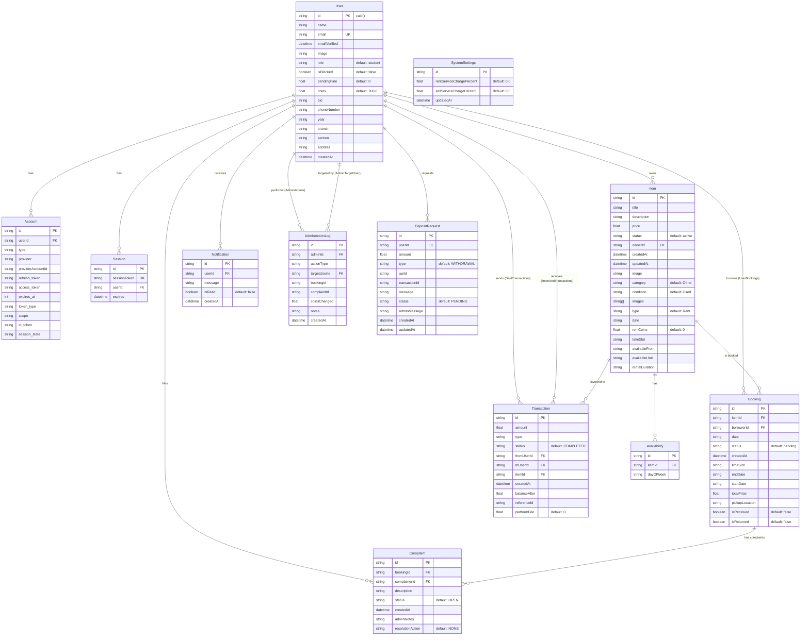

# CampusShare — Database Schema

> **ORM:** Prisma `5.10.2` | **Database:** PostgreSQL (Supabase) | **Schema:** `prisma/schema.prisma`

---

## Connection Configuration

```prisma
datasource db {
  provider  = "postgresql"
  url       = env("DATABASE_URL")      // PgBouncer pooled connection (port 6543)
  directUrl = env("DIRECT_URL")        // Direct connection (port 5432, for migrations)
}
```

- **Pooler:** Supabase PgBouncer on port `6543` (used at runtime)
- **Direct:** Port `5432` (used for `prisma migrate` and `prisma db push`)

---

## Entity-Relationship Diagram



---

## Model Details

### User

| Field | Type | Constraints | Purpose |
|---|---|---|---|
| `id` | `String` | PK, `cuid()` | Primary key |
| `name` | `String?` | — | Display name |
| `email` | `String?` | Unique | Login email (from Google OAuth) |
| `emailVerified` | `DateTime?` | — | OAuth verification timestamp |
| `image` | `String?` | — | Profile picture URL (Google/Cloudinary) |
| `role` | `String` | Default: `"student"` | `"student"` or `"admin"` |
| `isBlocked` | `Boolean` | Default: `false` | Admin can block users |
| `pendingFine` | `Float` | Default: `0` | Accumulated unpaid fines |
| `coins` | `Float` | Default: `200.0` | Virtual currency balance |
| `bio` | `String?` | — | User biography |
| `phoneNumber` | `String?` | — | Contact number |
| `year` | `String?` | — | Academic year |
| `branch` | `String?` | — | Academic branch/department |
| `section` | `String?` | — | Class section |
| `address` | `String?` | — | Physical address/room |
| `createdAt` | `DateTime` | Default: `now()` | Account creation time |

**Delete Behavior:** Cascades to `Account`, `Session`, `Item`, `Booking`, `Notification`, `Complaint`, `DepositRequest`

---

### Item

| Field | Type | Constraints | Purpose |
|---|---|---|---|
| `id` | `String` | PK, `cuid()` | Primary key |
| `title` | `String` | Required | Item name |
| `description` | `String` | Required | Detailed description |
| `price` | `Float` | Required | Cost in coins (per day for rent, total for sell) |
| `status` | `String` | Default: `"active"` | `active`, `AVAILABLE`, `PENDING`, `BOOKED`, `COMPLETED`, `EXPIRED`, `sold` |
| `ownerId` | `String` | FK → User | Item owner |
| `image` | `String?` | — | Legacy single thumbnail |
| `images` | `String[]` | — | Multiple image URLs (Cloudinary) |
| `category` | `String` | Default: `"Other"` | Item category |
| `condition` | `String` | Default: `"Used"` | Physical condition |
| `type` | `String` | Default: `"Rent"` | `"Rent"` or `"Sell"` |
| `date` | `String?` | — | Specific availability date |
| `rentCoins` | `Float` | Default: `0` | Rent cost in coins |
| `timeSlot` | `String?` | — | Available time slot |
| `availableFrom` | `String?` | — | Start of availability window |
| `availableUntil` | `String?` | — | End of availability window |
| `rentalDuration` | `String?` | — | Duration label |

---

### Booking

| Field | Type | Constraints | Purpose |
|---|---|---|---|
| `status` | `String` | Default: `"pending"` | See booking lifecycle below |
| `isReceived` | `Boolean` | Default: `false` | Borrower confirmed receipt |
| `isReturned` | `Boolean` | Default: `false` | Borrower confirmed return |
| `totalPrice` | `Float?` | — | Calculated rental cost |
| `pickupLocation` | `String?` | — | Set by owner on acceptance |

**Status Values:** `pending`/`PENDING`, `ACCEPTED`, `REJECTED`, `COMPLETED`, `RECEIVED`, `RETURN_FLOW`, `PENDING_OWNER_CONFIRMATION`, `PENDING_BORROWER_CONFIRMATION`, `SUCCESSFUL`, `EXPIRED`, `CANCELLED`

---

### Transaction

| Field | Type | Purpose |
|---|---|---|
| `type` | `String` | `PURCHASE`, `RENT_PAYMENT`, `REFUND`, `FINE`, `DEPOSIT`, `WITHDRAWAL` |
| `status` | `String` | Default: `COMPLETED` |
| `platformFee` | `Float` | Service charge deducted |
| `referenceId` | `String?` | Links to booking/complaint ID |
| `balanceAfter` | `Float?` | User balance post-transaction |

---

### Indexes & Constraints

| Model | Index/Constraint | Fields |
|---|---|---|
| `Account` | Unique composite | `[provider, providerAccountId]` |
| `Session` | Unique | `sessionToken` |
| `User` | Unique | `email` |
| `Availability` | Unique composite | `[itemId, dayOfWeek]` |
| `DepositRequest` | Index | `userId` |

---

## Seed Script

File: `prisma/seed.ts`

Creates initial data for development testing. Run via:
```bash
npx prisma db seed
```
