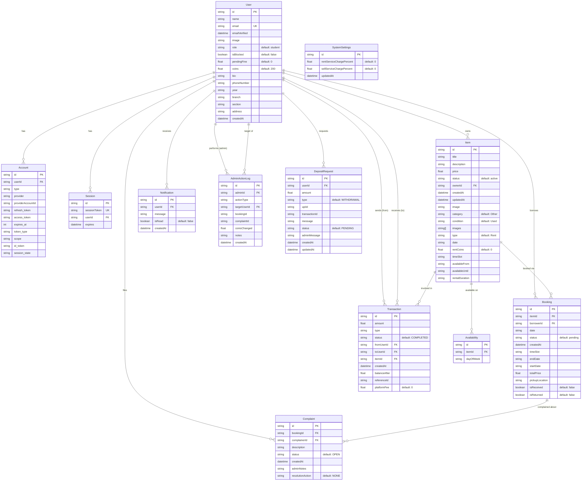

# CampusShare — Database Schema

## ORM & Database

| Property | Value |
|---|---|
| **ORM** | Prisma 5.10.2 |
| **Database** | PostgreSQL (Supabase) |
| **Schema File** | `prisma/schema.prisma` |
| **Connection** | Pooled via PgBouncer (`DATABASE_URL`, port 6543) |
| **Direct Connection** | `DIRECT_URL` (port 5432, for migrations) |

---

## Entity Relationship Diagram



---

## Table Details

### User
| Field | Type | Constraints | Notes |
|---|---|---|---|
| id | String | PK, CUID | Auto-generated |
| name | String? | | Google profile name |
| email | String? | Unique | Google email |
| emailVerified | DateTime? | | Set by NextAuth |
| image | String? | | Google profile pic URL |
| role | String | Default: `"student"` | `"student"` or `"admin"` |
| isBlocked | Boolean | Default: `false` | Admin-toggled block |
| pendingFine | Float | Default: `0` | Unfulfilled fine amount |
| coins | Float | Default: `200.0` | Virtual currency balance |
| bio | String? | | User bio text |
| phoneNumber | String? | | Contact number |
| year | String? | | Academic year |
| branch | String? | | Academic branch |
| section | String? | | Academic section |
| address | String? | | Address |
| createdAt | DateTime | Default: `now()` | Registration timestamp |

### Item
| Field | Type | Constraints | Notes |
|---|---|---|---|
| id | String | PK, CUID | |
| title | String | Required | Max 200 chars (API-enforced) |
| description | String | Required | Max 2000 chars (API-enforced) |
| price | Float | Required | Per-day rental or sale price in coins |
| status | String | Default: `"active"` | `active`, `AVAILABLE`, `PENDING`, `BOOKED`, `sold`, `COMPLETED`, `EXPIRED` |
| ownerId | String | FK → User | Cascade delete |
| image | String? | | Legacy single image URL |
| images | String[] | | Array of Cloudinary URLs |
| category | String | Default: `"Other"` | Item category |
| condition | String | Default: `"Used"` | Item condition |
| type | String | Default: `"Rent"` | `"Rent"` or `"Sell"` |
| date | String? | | Specific date (YYYY-MM-DD) |
| rentCoins | Float | Default: `0` | Rental coin amount |
| timeSlot | String? | | Time slot for rental |
| availableFrom | String? | | Start of availability window |
| availableUntil | String? | | End of availability window |
| rentalDuration | String? | | Duration label |

### Booking
| Field | Type | Constraints | Notes |
|---|---|---|---|
| id | String | PK, CUID | |
| itemId | String | FK → Item | Cascade delete |
| borrowerId | String | FK → User | Cascade delete |
| date | String? | | Legacy single date |
| startDate | String? | | Rental start (YYYY-MM-DD) |
| endDate | String? | | Rental end (YYYY-MM-DD) |
| status | String | Default: `"pending"` | See Booking Status Flow below |
| totalPrice | Float? | | Calculated: price × days |
| timeSlot | String? | | Time slot |
| pickupLocation | String? | | Set on accept |
| isReceived | Boolean | Default: `false` | Return flow: borrower confirms |
| isReturned | Boolean | Default: `false` | Return flow: owner confirms |

### Booking Status Flow

```
PENDING → ACCEPTED → COMPLETED (Paid) → RECEIVED → RETURN_FLOW
                                                         │
                                    ┌────────────────────┤
                                    ▼                    ▼
                        PENDING_OWNER_     PENDING_BORROWER_
                        CONFIRMATION       CONFIRMATION
                                    │                    │
                                    └────────┬───────────┘
                                             ▼
                                        SUCCESSFUL
                                    (Item → active again)

PENDING → REJECTED (Item → AVAILABLE)
PENDING → EXPIRED (date passed)
ACCEPTED/COMPLETED → CANCELLED (admin rollback)
```

### Transaction
| Type Values | Description |
|---|---|
| `RENT_PAYMENT` | Renter pays for rental |
| `PURCHASE` | Buyer purchases item |
| `REFUND` | Admin rollback refund |
| `FINE` | Admin fine transfer |
| `WITHDRAWAL` | User coin withdrawal |
| `DEPOSIT` | User coin deposit |

### Indexes
| Table | Index | Type |
|---|---|---|
| Account | `[provider, providerAccountId]` | Unique composite |
| Session | `sessionToken` | Unique |
| User | `email` | Unique |
| Availability | `[itemId, dayOfWeek]` | Unique composite |
| DepositRequest | `userId` | Index |

---

## Data Flow

```
UI (Client Component)
    │
    ▼ fetch('/api/...')
API Route Handler
    │
    ▼ getServerSession() → Auth Check
    │
    ▼ db.model.findMany/create/update/delete
Prisma Client
    │
    ▼ SQL Query
PostgreSQL (Supabase)
    │
    ▼ Result rows
Prisma Client
    │
    ▼ Typed objects
API Route Handler
    │
    ▼ NextResponse.json()
UI (setState → re-render)
```

### Coin Transfer Flow (Payment)

```
Renter clicks "Pay"
    │
    ▼
POST /api/bookings/[id]/pay
    │
    ▼ db.$transaction()
    │   1. user.update(renter, decrement: cost)
    │   2. systemSettings.findFirst() → service charge %
    │   3. user.update(owner, increment: cost - serviceCharge)
    │   4. transaction.create(RENT_PAYMENT, platformFee: serviceCharge)
    │   5. booking.updateMany(status → COMPLETED)
    │   6. item.update(status → BOOKED or sold)
    │   7. notification.create(owner)
    │
    ▼ JSON response
```
