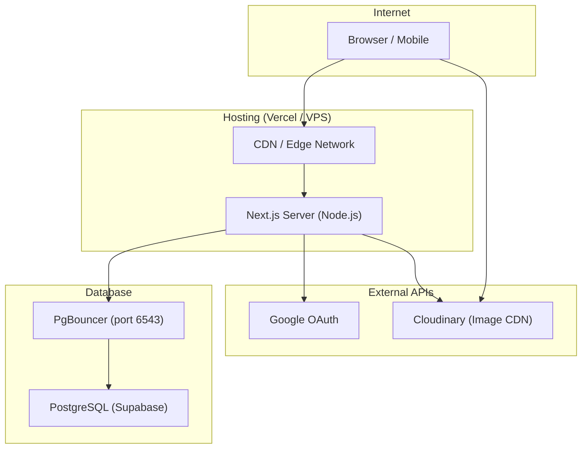

# CampusShare — Deployment Guide

---

## Build Configuration

| Property | Value |
|---|---|
| **Build Command** | `prisma generate && next build` |
| **Output Mode** | Standalone Node.js server (default) |
| **Start Command** | `next start` |
| **Node.js** | ≥ 18.x required |
| **Port** | `3000` (default) |

---

## Deployment Options

### Option 1: Vercel (Recommended)

Vercel is the native hosting platform for Next.js.

#### Steps

1. **Connect Repository:**
   - Go to [vercel.com](https://vercel.com) → Import Git Repository
   - Select the `campusshare` repository

2. **Configure Environment Variables:**
   - Add all variables from [ENV_SETUP.md](./ENV_SETUP.md)
   - Set `NEXTAUTH_URL` to your production domain (e.g., `https://campusshare.vercel.app`)

3. **Configure Build Settings:**
   ```
   Build Command: prisma generate && next build
   Output Directory: .next
   Install Command: npm install
   ```

4. **Deploy:**
   - Vercel auto-deploys on push to `main` branch
   - Preview deployments on pull requests

5. **Post-Deploy:**
   - Update Google OAuth redirect URI to `https://yourdomain.com/api/auth/callback/google`
   - Verify `NEXTAUTH_URL` matches the deployed domain exactly

#### Vercel-Specific Notes
- Serverless functions have a 10s default timeout (upgrade plan for longer)
- Database connections use PgBouncer (`DATABASE_URL` with `?pgbouncer=true`)
- `DIRECT_URL` is needed for Prisma migrations (run locally, not on Vercel)

---

### Option 2: Node.js VPS (Self-Hosted)

#### Prerequisites
- Linux server with Node.js ≥ 18.x
- PM2 or systemd for process management
- Nginx as reverse proxy
- SSL certificate (Let's Encrypt)

#### Steps

```bash
# 1. Clone and install
git clone https://github.com/KollaUpendra/campusshare.git
cd campusshare
npm install

# 2. Configure environment
cp .env.example .env
nano .env  # Set all production variables

# 3. Generate Prisma Client & push schema
npx prisma generate
npx prisma db push

# 4. Build
npm run build

# 5. Start with PM2
pm2 start npm --name "campusshare" -- start
pm2 save
pm2 startup
```

#### Nginx Configuration

```nginx
server {
    listen 80;
    server_name yourdomain.com;
    return 301 https://$server_name$request_uri;
}

server {
    listen 443 ssl;
    server_name yourdomain.com;

    ssl_certificate /etc/letsencrypt/live/yourdomain.com/fullchain.pem;
    ssl_certificate_key /etc/letsencrypt/live/yourdomain.com/privkey.pem;

    location / {
        proxy_pass http://127.0.0.1:3000;
        proxy_http_version 1.1;
        proxy_set_header Upgrade $http_upgrade;
        proxy_set_header Connection 'upgrade';
        proxy_set_header Host $host;
        proxy_set_header X-Real-IP $remote_addr;
        proxy_set_header X-Forwarded-For $proxy_add_x_forwarded_for;
        proxy_set_header X-Forwarded-Proto $scheme;
        proxy_cache_bypass $http_upgrade;
    }
}
```

---

### Option 3: Docker

> **Note:** No `Dockerfile` or `docker-compose.yml` exists in the repository. Below is a proposed configuration.

#### Dockerfile

```dockerfile
FROM node:18-alpine AS base

# Install dependencies
FROM base AS deps
WORKDIR /app
COPY package.json package-lock.json ./
COPY prisma ./prisma/
RUN npm ci
RUN npx prisma generate

# Build
FROM base AS builder
WORKDIR /app
COPY --from=deps /app/node_modules ./node_modules
COPY . .
RUN npm run build

# Production
FROM base AS runner
WORKDIR /app
ENV NODE_ENV production

COPY --from=builder /app/public ./public
COPY --from=builder /app/.next/standalone ./
COPY --from=builder /app/.next/static ./.next/static

EXPOSE 3000
CMD ["node", "server.js"]
```

> **Important:** To use Docker standalone mode, add to `next.config.mjs`:
> ```js
> output: 'standalone',
> ```

#### docker-compose.yml

```yaml
version: '3.8'
services:
  app:
    build: .
    ports:
      - "3000:3000"
    env_file: .env
    depends_on:
      - db
    restart: unless-stopped

  db:
    image: postgres:15-alpine
    environment:
      POSTGRES_DB: campusshare
      POSTGRES_USER: postgres
      POSTGRES_PASSWORD: your_password
    volumes:
      - pgdata:/var/lib/postgresql/data
    ports:
      - "5432:5432"

volumes:
  pgdata:
```

---

## Required External Services

| Service | Purpose | Required |
|---|---|---|
| **Supabase / PostgreSQL** | Primary database | ✅ |
| **Google Cloud Console** | OAuth authentication | ✅ |
| **Cloudinary** | Image upload & CDN | ✅ |
| **DiceBear** | Avatar generation (landing page) | ❌ (decorative only) |

---

## Infrastructure Diagram



---

## Production Checklist

- [ ] Set `NEXTAUTH_SECRET` to a strong random value (`openssl rand -base64 32`)
- [ ] Set `NEXTAUTH_URL` to production domain with HTTPS
- [ ] Update Google OAuth redirect URI to production callback URL
- [ ] Ensure `DATABASE_URL` uses PgBouncer connection
- [ ] Run `npx prisma db push` or `npx prisma migrate deploy` against production DB
- [ ] Verify Cloudinary credentials are correct
- [ ] Set `NODE_ENV=production`
- [ ] Remove or rotate any development secrets from `.env`
- [ ] Configure HTTPS (SSL/TLS)
- [ ] Set up monitoring and error tracking
- [ ] Configure backup strategy for PostgreSQL

---

## CI/CD

**Status:** Not Found in Codebase

No CI/CD pipeline configuration files (`.github/workflows/`, `vercel.json`, `Jenkinsfile`, etc.) were found in the repository.

### Recommended GitHub Actions Workflow

```yaml
name: Deploy
on:
  push:
    branches: [main]

jobs:
  deploy:
    runs-on: ubuntu-latest
    steps:
      - uses: actions/checkout@v4
      - uses: actions/setup-node@v4
        with:
          node-version: 18
      - run: npm ci
      - run: npx prisma generate
      - run: npm run build
      - run: npx playwright install --with-deps
      - run: npx playwright test
```
