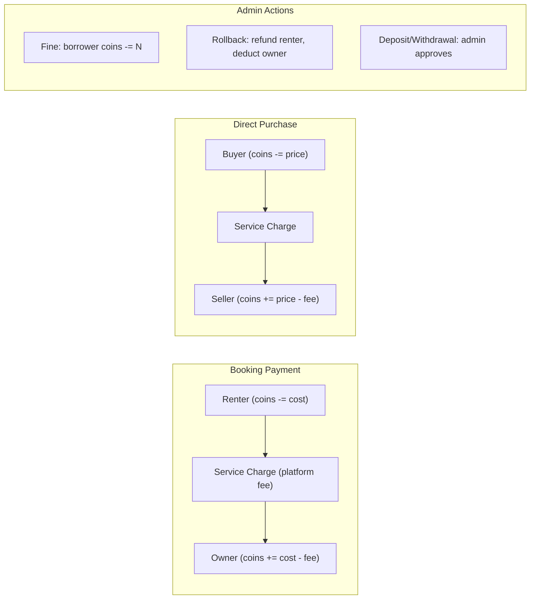

# CampusShare — System Architecture

> **Generated:** 2026-02-21 | **Framework:** Next.js 16.1.6 | **Runtime:** Node.js

---

## 1. Framework Overview

| Property | Value | Evidence |
|---|---|---|
| **Next.js Version** | `16.1.6` | `package.json` line 26 |
| **React Version** | `19.2.3` | `package.json` lines 30-31 |
| **Router** | App Router (exclusively) | All routes under `src/app/` |
| **Pages Router** | Not used | No `pages/` directory exists |
| **Hybrid Routing** | No | App Router only |
| **Server Components** | Yes — default for all page/layout files | `page.tsx`, `layout.tsx` files lack `"use client"` |
| **Client Components** | Yes — explicit opt-in | `"use client"` in components (`Header.tsx`, `AppShell.tsx`, `ItemCard.tsx`, `AddItemForm.tsx`, etc.) |
| **Server Actions** | Not used | No `"use server"` directives found |
| **Middleware** | Yes | `src/middleware.ts` — route protection + RBAC |
| **Edge Runtime** | Not used | No `export const runtime = "edge"` found |
| **Static Rendering (SSG)** | Landing page (`/`), `/privacy`, `/terms` | No dynamic data fetching at build time |
| **Dynamic Rendering (SSR)** | Dashboard, profile, admin pages | Session-dependent `getServerSession()` calls |
| **ISR** | Not configured | No `revalidate` exports found |
| **Image Optimization** | Next.js `<Image>` component | `next.config.mjs` allows `lh3.googleusercontent.com` and `res.cloudinary.com` |
| **Auth Pattern** | NextAuth v4 + Google OAuth + JWT strategy | `src/lib/auth.ts`, `@auth/prisma-adapter` |
| **State Management** | None (props + `useSession`) | No Redux/Zustand/Context/React Query/SWR |
| **API Layer** | Route Handlers (App Router) | All in `src/app/api/` — REST endpoints |
| **ORM** | Prisma `5.10.2` | `prisma/schema.prisma`, `@prisma/client` |
| **Database** | PostgreSQL (Supabase) | `datasource db { provider = "postgresql" }` |

---

## 2. Request Lifecycle


---

## 3. Directory Structure

```
campusshare/
├── prisma/
│   ├── schema.prisma          # 12 models, PostgreSQL
│   └── seed.ts                # Database seeding script
├── src/
│   ├── middleware.ts           # Route protection + RBAC
│   ├── app/
│   │   ├── layout.tsx          # Root layout (Providers, AppShell, Toaster)
│   │   ├── page.tsx            # Landing page (PublicGuard)
│   │   ├── loading.tsx         # Global loading skeleton
│   │   ├── globals.css         # CSS variables (shadcn/ui design tokens)
│   │   ├── admin/              # Admin panel (6 pages)
│   │   ├── api/                # 33 API route files
│   │   ├── auth/signin/        # Sign-in page
│   │   ├── dashboard/          # User dashboard + bookings
│   │   ├── items/[id]/         # Item detail + edit
│   │   ├── my-items/           # User's listed items
│   │   ├── post-item/          # New item listing form
│   │   ├── profile/            # User profile + payments
│   │   ├── search/             # Item search page
│   │   └── transactions/       # Transaction history
│   ├── components/
│   │   ├── admin/              # 6 admin components
│   │   ├── auth/               # 5 auth components (guards, buttons, providers)
│   │   ├── items/              # 4 item components (card, form, booking button)
│   │   ├── layout/             # 4 layout components (AppShell, Header, BottomNav)
│   │   ├── profile/            # 5 profile components (dialogs, deposit)
│   │   └── ui/                 # 13 shadcn/ui primitives
│   ├── lib/
│   │   ├── auth.ts             # NextAuth configuration
│   │   ├── db.ts               # Prisma singleton
│   │   ├── profile.ts          # Profile completion check
│   │   ├── scheduler.ts        # Booking expiration processor
│   │   └── utils.ts            # cn() utility (clsx + twMerge)
│   └── types/
│       └── next-auth.d.ts      # Extended Session & JWT types
├── tests/                      # 5 Playwright test files
├── scripts/                    # 12 utility scripts
├── next.config.mjs             # Image domains, dev indicators
├── tailwind.config.js          # shadcn/ui design system
├── playwright.config.ts        # E2E test config
└── package.json                # Dependencies & scripts
```

---

## 4. Component Architecture


---

## 5. Authentication Architecture

### Flow

1. **User clicks "Sign In"** → redirected to `/auth/signin`
2. **Google OAuth** via `next-auth/providers/google`
3. **signIn callback** checks if user is blocked (`isBlocked: true` → deny)
4. **JWT callback** attaches `id`, `role`, `coins`, profile fields to token
5. **Session callback** propagates token fields to `session.user`
6. **Middleware** intercepts protected routes, verifies JWT, checks admin role

### Strategy

| Property | Value |
|---|---|
| Strategy | `jwt` (not `database`) |
| Session Duration | 30 days |
| Adapter | `PrismaAdapter` (for User/Account/Session persistence) |
| Provider | Google OAuth |
| Custom Fields on Token | `id`, `role`, `coins`, `year`, `branch`, `section`, `address`, `phoneNumber` |
| Blocked User Check | At sign-in time AND on every JWT refresh |
| Custom Sign-In Page | `/auth/signin` |

### Middleware Protection Matrix

| Route Pattern | Auth Required | Role Required |
|---|---|---|
| `/dashboard/*` | ✅ | Any |
| `/admin/*` | ✅ | `admin` |
| `/post-item` | ✅ | Any |
| `/app/*` | ✅ | Any |
| `/api/auth/*` | ❌ (bypass) | — |
| All other routes | ❌ | — |

### Route Guards

| Guard | Type | Location | Behavior |
|---|---|---|---|
| `AuthGuard` | Server Component | `src/components/auth/AuthGuard.tsx` | Redirects to `/` if no session |
| `PublicGuard` | Server Component | `src/components/auth/PublicGuard.tsx` | Redirects to `/dashboard` if session exists |
| `AdminLayout` | Server Layout | `src/app/admin/layout.tsx` | Redirects to `/` if `role !== "admin"` |

---

## 6. Data Flow Patterns

### Coin Economy Flow



### Booking Lifecycle


---

## 7. Infrastructure Diagram


---

## 8. Rendering Strategy Summary

| Route | Rendering | Reason |
|---|---|---|
| `/` (Landing) | SSR | `PublicGuard` calls `getServerSession()` |
| `/auth/signin` | SSR | Static page with client SignInButton |
| `/dashboard` | SSR | `getServerSession()` + DB queries |
| `/items/[id]` | SSR | Dynamic item data from DB |
| `/admin/*` | SSR | `AdminLayout` checks session + role |
| `/search` | SSR | DB query for items |
| `/profile` | SSR | Session-dependent profile data |
| `/privacy`, `/terms` | Static-like SSR | Minimal dynamic content |
| `/api/*` | Dynamic | Route Handlers — all server-side |

> **Note:** No pages use `generateStaticParams()`, `revalidate`, or `force-static`. All pages are dynamically rendered on every request.

---

## 9. Caching & Performance

| Strategy | Status | Details |
|---|---|---|
| **ISR** | Not configured | No `revalidate` exports |
| **Full Route Cache** | Disabled | All pages are dynamic (session-dependent) |
| **Data Cache** | Default Prisma behavior | No explicit cache invalidation |
| **Client Cache** | None | No SWR/React Query — manual `fetch()` with `router.refresh()` |
| **CDN** | Cloudinary for images | `res.cloudinary.com` allowed in `next.config.mjs` |
| **Image Optimization** | Next.js `<Image>` | Remote patterns for Google + Cloudinary |
| **Dev Indicators** | Disabled | `appIsrStatus: false, buildActivity: false` in `next.config.mjs` |
