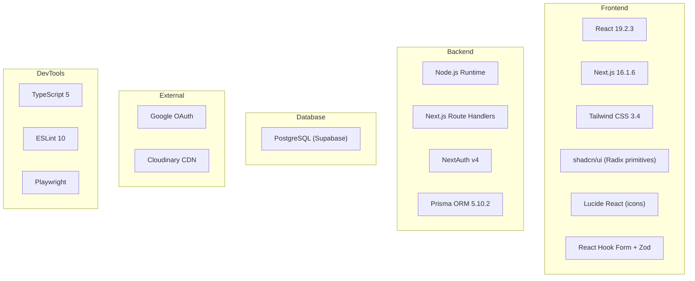

# CampusShare — Technology Stack

---

## Stack Overview

---

## Detailed Dependency Analysis

### Core Framework

| Package | Version | Purpose | Used By |
|---|---|---|---|
| `next` | `16.1.6` | Full-stack React framework (App Router, SSR, API routes) | Entire application |
| `react` | `19.2.3` | UI library | All components |
| `react-dom` | `19.2.3` | React DOM rendering | Root layout |

---

### Authentication

| Package | Version | Purpose | Used By |
|---|---|---|---|
| `next-auth` | `^4.24.13` | Authentication framework (JWT, OAuth, session management) | `src/lib/auth.ts`, `middleware.ts`, all API routes |
| `@auth/prisma-adapter` | `^2.11.1` | Connects NextAuth to Prisma for User/Account/Session persistence | `src/lib/auth.ts` |

---

### Database

| Package | Version | Purpose | Used By |
|---|---|---|---|
| `@prisma/client` | `5.10.2` | Type-safe database client (PostgreSQL) | `src/lib/db.ts`, all API routes |
| `prisma` | `5.10.2` (dev) | Schema management, migrations, generation | Build scripts, CLI |

---

### Styling

| Package | Version | Purpose | Used By |
|---|---|---|---|
| `tailwindcss` | `^3.4.1` | Utility-first CSS framework | All components |
| `autoprefixer` | `^10.4.24` | CSS vendor prefix automation | `postcss.config.js` |
| `postcss` | `^8.5.6` | CSS transformation pipeline | Build process |
| `tailwind-merge` | `^3.4.0` | Intelligent Tailwind class merging (deduplication) | `src/lib/utils.ts` (`cn()`) |
| `tailwind-animate` | `^0.2.10` | Animation utilities for Tailwind | `tailwind.config.js` (plugin) |
| `clsx` | `^2.1.1` | Conditional class name builder | `src/lib/utils.ts` (`cn()`) |
| `class-variance-authority` | `^0.7.1` | Component variant management (for shadcn/ui) | UI components (`button.tsx`, etc.) |

---

### UI Components

| Package | Version | Purpose | Used By |
|---|---|---|---|
| `@radix-ui/react-slot` | `^1.2.4` | Polymorphic slot component (shadcn/ui Button `asChild`) | `src/components/ui/button.tsx` |
| `@radix-ui/react-toast` | `^1.2.15` | Accessible toast notification primitive | `src/components/ui/toast.tsx`, `toaster.tsx` |
| `@radix-ui/react-popover` | `^1.1.15` | Popover primitive | `src/components/ui/popover.tsx` |
| `@radix-ui/react-icons` | `^1.3.2` | Icon library | Various components |
| `lucide-react` | `^0.563.0` | Modern icon set (Feather-based) | Header, nav, cards, admin |

---

### Form Handling

| Package | Version | Purpose | Used By |
|---|---|---|---|
| `react-hook-form` | `^7.71.1` | Performant form library with uncontrolled components | `AddItemForm.tsx`, `EditProfileDialog.tsx` |
| `@hookform/resolvers` | `^5.2.2` | Validation resolver bridge (connects Zod to react-hook-form) | `AddItemForm.tsx` |
| `zod` | `^4.3.6` | TypeScript-first schema validation | `AddItemForm.tsx` (client-side validation) |

---

### Image Handling

| Package | Version | Purpose | Used By |
|---|---|---|---|
| `cloudinary` | `^2.9.0` | Server-side Cloudinary SDK (signing uploads) | `src/app/api/sign-cloudinary/route.ts` |
| `next-cloudinary` | `^6.17.5` | Cloudinary integration for Next.js | Image upload components |

---

### Utilities

| Package | Version | Purpose | Used By |
|---|---|---|---|
| `date-fns` | `^4.1.0` | Date formatting and manipulation | Booking date handling, admin pages |

---

### Development Tools

| Package | Version | Purpose | Used By |
|---|---|---|---|
| `typescript` | `^5` | Type safety | Entire codebase |
| `@types/node` | `^20` | Node.js type definitions | TypeScript compilation |
| `@types/react` | `^19` | React type definitions | TypeScript compilation |
| `@types/react-dom` | `^19` | React DOM type definitions | TypeScript compilation |
| `eslint` | `^10.0.0` | Code linting | `npm run lint` |
| `eslint-config-next` | `^0.2.4` | Next.js-specific ESLint rules | `eslint.config.mjs` |
| `@playwright/test` | `^1.58.2` | End-to-end browser testing | `tests/` directory |

---

## Design System

The project uses **shadcn/ui** — a collection of reusable components built with Radix UI primitives and Tailwind CSS.

### Design Tokens (CSS Variables)

Defined in `src/app/globals.css`:

| Token | Light Value | Purpose |
|---|---|---|
| `--primary` | `243 75% 59%` (Indigo-600) | Primary brand color |
| `--secondary` | `215 28% 17%` (Slate-800) | Secondary actions |
| `--accent` | `38 92% 50%` (Amber-500) | Price tags, highlights |
| `--destructive` | `0 84% 60%` (Red-500) | Delete, error states |
| `--background` | `210 20% 98%` | Page background |
| `--card` | `0 0% 100%` | Card backgrounds |
| `--muted` | `210 40% 96%` | Muted text/bg |
| `--radius` | `0.75rem` | Border radius |

### Dark Mode

Fully configured with CSS variables in `.dark` class. Toggle mechanism: Tailwind `darkMode: ["class"]`.

### shadcn/ui Components Used

| Component | File | Purpose |
|---|---|---|
| Badge | `ui/badge.tsx` | Status labels, tags |
| Button | `ui/button.tsx` | All interactive buttons |
| Card | `ui/card.tsx` | Item cards, profile cards |
| Dialog | `ui/dialog.tsx` | Modals (edit profile, deposits) |
| Input | `ui/input.tsx` | Form text inputs |
| Label | `ui/label.tsx` | Form labels |
| Popover | `ui/popover.tsx` | Dropdown menus |
| Separator | `ui/separator.tsx` | Visual dividers |
| Table | `ui/table.tsx` | Admin data tables |
| Textarea | `ui/textarea.tsx` | Multi-line inputs |
| Toast | `ui/toast.tsx` | Notification toasts |
| Toaster | `ui/toaster.tsx` | Toast container |

---

## Architecture Patterns

| Pattern | Implementation |
|---|---|
| **Component composition** | shadcn/ui + Radix primitives |
| **Form management** | React Hook Form + Zod |
| **Class merging** | `cn()` utility (clsx + tailwind-merge) |
| **DB access** | Prisma singleton (`src/lib/db.ts`) |
| **Auth** | NextAuth with PrismaAdapter + JWT |
| **Image upload** | Signed Cloudinary uploads |
| **Type augmentation** | `src/types/next-auth.d.ts` extends Session/JWT |
